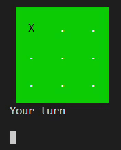
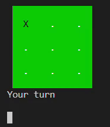

# Colorful-TicTacToe

# Features #
- AI mode (minimax algorithm + alpha-beta pruning)
- 2-player mode
- Winning move is displayed at the end of each game

# 🚀 Getting Started #
> ⚠️ Game may not work properly on online compilers and on Mac OS.
> 
Run the code in `main.cpp` in a C++ compiler or an [online C++compiler](https://www.onlinegdb.com/online_c++_compiler). 

# Future work #
- [ ] Eliminate screen/cursor flicker
- [ ] Add themes
