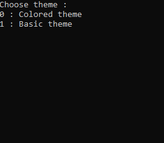

# 🎮 TicTacToe

Implementation of TicTacToe in console with multiple themes.
Theme 1:

Theme 2:

## 🌟Features
- AI mode (minimax algorithm + alpha-beta pruning)
- 2 themes : ASCII theme and Color theme
- 2-player mode
- Winning move is displayed at the end of each game

## 🚀 Getting Started
> 🔴 Game may not work properly on online compilers and on Mac OS.

Run the code in `main.cpp` in a C++ compiler or an [online C++compiler](https://www.onlinegdb.com/online_c++_compiler). 

Input format : `<row><space><column>` , where `<row>` and `<column>` are integers between  1 and 3 inclusive.

Note : AI will take a few seconds to calculate optimal starting move but becomes faster later on.

## 🔮 Future work
- [x] Eliminate screen/cursor flicker
- [x] Add themes
- [x] Trace win for basic theme
- [x] Get rid of namespace std
